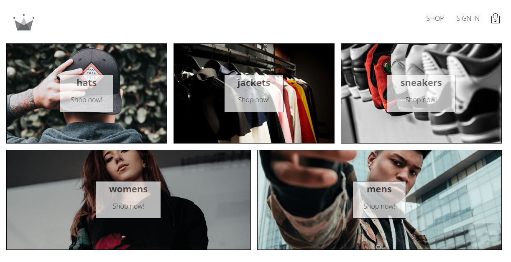
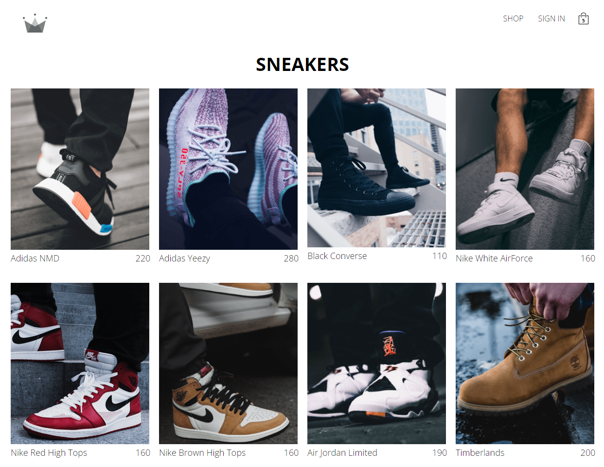

# Crown Clothing

## An Web-Shop Application dedicated to bring the latest in fashion and accessories

## Course Context

This project was created as part of Complete React Developer (w/ Redux, Hooks, GraphQL), offered by Udemy.
It serves as a practical application of the concepts of React/JS/TS/Firebase/Context API/Redux/Stripe Payments and Hooks.

## Project status

The project has been finished. User can look for different clothes and accessories,
add them to the cart and 'pay' with Stripe.

## Project Screen Shots

## Reflection

The project represents an example which integrates different technologies for creating and web application. During learning
process I have consolidated my knowledge regarding React and Hooks. Other than that I have learned to deploy to production
by using Netlify. The authentication was set with Firebase, which helps for creating new accounts and managing them. Also,
when we talk about state which initally was set as local, later was shared across components by using Context API. Later,
instead of Context API, Redux was used. Also, Stripe was integrated, but just for testing puroses. The deployed app can be
[here](https://main--sparkling-palmier-48f567.netlify.app/).
